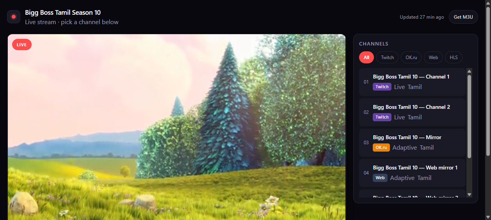
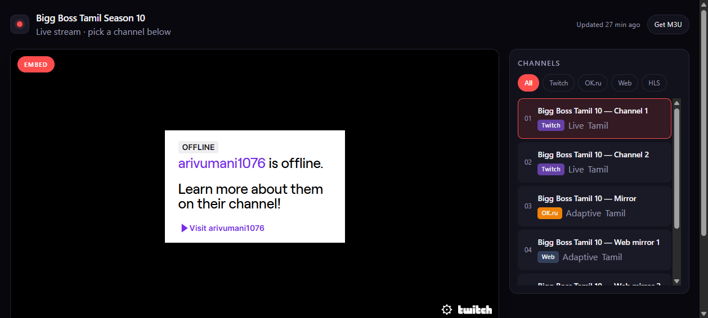

# Bigg Boss Tamil — Live

A clean, fast live-stream player. One static page, no build step, no framework:
open it, pick a channel, it plays.

[](https://github.com/Jeeva-zone/bbtamil10/actions/workflows/pages.yml)
[](https://github.com/Jeeva-zone/bbtamil10/actions/workflows/check-streams.yml)
[](LICENSE)
[](package.json)

**Live site:** https://jeeva-zone.github.io/bbtamil10/

| HLS playback | Platform embeds |
| --- | --- |
|  |  |

---

## What it does

- **Plays HLS properly.** A real `<video>` element, using the browser's native HLS
  support where it exists (Safari, iOS, Android Chrome) and [hls.js](https://github.com/video-dev/hls.js)
  everywhere else. hls.js is only downloaded when a stream actually needs it.
- **Falls back to platform embeds.** Twitch, YouTube, OK.ru and generic web players
  are rendered in an iframe when a direct stream is not available.
- **Auto-reconnects.** A dropped stream retries up to three times with backoff before
  showing an error, and the error state always offers a manual retry.
- **Deep links.** `?s=<stream-id>` opens straight into a channel, so every stream is
  shareable and usable as an IPTV target.
- **Works offline.** A service worker keeps the app shell available; the stream list
  is always fetched network-first so updates land immediately.
- **Installable.** Web app manifest, so it can be added to a phone home screen.
- **Keyboard driven.** <kbd>space</kbd> play/pause, <kbd>m</kbd> mute, <kbd>f</kbd>
  fullscreen, <kbd>←</kbd>/<kbd>→</kbd> change channel, <kbd>r</kbd> reload.

## Pages

| Path | Purpose |
| --- | --- |
| `index.html` | Player plus the channel list and platform filters |
| `player.html` | Player only — the target for `playlist_web.m3u` and deep links |
| `playlist.m3u` | Direct stream URLs for IPTV players |
| `playlist_web.m3u` | Same channels, routed through the web player |

## Adding or changing a channel

Everything comes from **`data/streams.json`** — the UI and the player never hardcode
anything. Add an entry and it shows up:

```json
{
  "id": "my-channel",
  "name": "Bigg Boss Tamil 10 — Channel 3",
  "platform": "HLS",
  "url": "https://example.com/live/stream.m3u8",
  "quality": "1080p",
  "language": "Tamil",
  "note": "Anything you want shown under the player."
}
```

The player type is inferred from the URL — `.m3u8` becomes HLS, `twitch.tv` a Twitch
embed, and so on. To force a strategy, set `"type": "hls"` or `"type": "iframe"`.

After editing, regenerate the playlists:

```bash
python3 tools/build_playlists.py
```

## Running locally

Any static file server works — ES modules and the service worker need `http://`, not `file://`.

```bash
python3 -m http.server 8080
# then open http://localhost:8080
```

## Architecture

```
index.html / player.html      thin shells, identical player markup
assets/css/app.css            one stylesheet, CSS custom properties, dark-first
assets/js/data.js             loads streams.json, detects platform, builds playable URLs
assets/js/player.js           playback engine: HLS via <video>, embeds via <iframe>
assets/js/app.js              UI, controls, deep links, keyboard, refresh
assets/js/util.js             DOM helpers (no innerHTML — metadata can't inject markup)
sw.js                         offline shell, network-first
data/streams.json             the catalogue — the only file you normally edit
```

Deliberate choices: no framework and no bundler (nothing to install, nothing to
break, instant deploys), native video controls (they bring fullscreen and
picture-in-picture for free and behave correctly on mobile), and network-first
caching (a stale stream list is worse than a slow one).

## Notes on the streams

The stream URLs in `data/streams.json` are third-party links, not part of this
project's source. They move, expire and go offline constantly — the scheduled
`Check streams` workflow pings each one and records what it finds, but the operator
is responsible for making sure they have the right to distribute whatever they point at.

## Credits

Built as a clean rewrite of [Durgaa17/bblive9](https://github.com/Durgaa17/bblive9)
(MIT), keeping the idea and dropping the moving parts.

## License

MIT — see [LICENSE](LICENSE).
